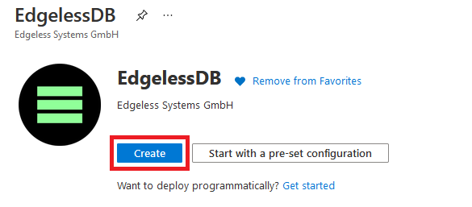
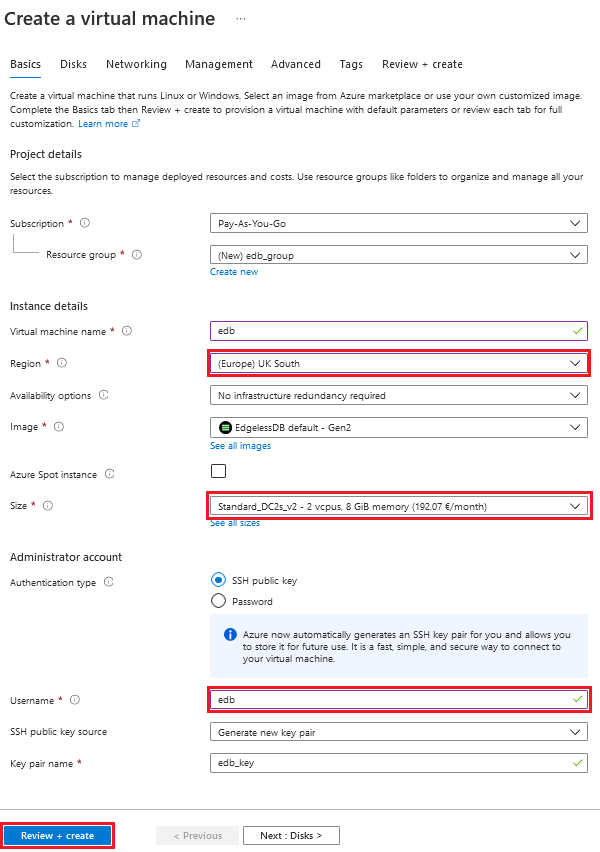

# Quickstart: Microsoft Azure
In this guide, you will set up EdgelessDB using the Microsoft Azure Marketplace.

## Get the machine
Visit the Azure Marketplace and get [EdglessDB](https://azuremarketplace.microsoft.com/en-us/marketplace/apps/edgelesssystems.edb?tab=Overview).



After that you have to configure the virtual machine in the creation wizard.

!> Important: To experience the full potential of EDB we recommend to choose a virtual machine size of the [DCsv2-series](https://docs.microsoft.com/en-us/azure/virtual-machines/dcv2-series). This guarantees, that your virtual machine supports Intel SGX.

The resource group you deploy your machine to has to be created in one of the regions where the DCsV2 sizes are [available](https://azure.microsoft.com/de-de/global-infrastructure/services/?products=virtual-machines&regions=all).

The value for the `Virtual machine name` can be freely selected.
The value for the `Username` **must** be set to _edb_.
Finally press the blue button `Review + Create` and after that the `Create` button to finish the setup process.



## Get the IP
After you have created the machine you need the public IP address to interact with it.
For that naviagte to the resource group your virtual machine was created in and select the virtual machine.
The public IP address is displayed on the right hand side in the `Essentials` section.

Alternatively you can use the [azure-cli](https://docs.microsoft.com/en-us/cli/azure/install-azure-cli) to get the public IP address:
```bash
 az vm show -d -g <resource-group> -n <vm-name> --query publicIps -o tsv
```

## Generate certificates and create a manifest
You will now create a manifest that defines a root user. This user is authenticated by an X.509 certificate.

Generate a certificate authority (CA) and a corresponding user certificate:
```bash
openssl req -x509 -newkey rsa -nodes -subj '/CN=My CA' -keyout ca-key.pem -out ca-cert.pem
openssl req -newkey rsa -nodes -subj '/CN=rootuser' -keyout key.pem -out csr.pem
openssl x509 -req -CA ca-cert.pem -CAkey ca-key.pem -CAcreateserial -in csr.pem -out cert.pem
```

Escape the line breaks of the CA certificate:
```bash
awk 1 ORS='\\n' ca-cert.pem
```

Create a file `manifest.json` with the following contents:
```json
{
    "sql": [
        "CREATE USER root REQUIRE ISSUER '/CN=My CA' SUBJECT '/CN=rootuser'",
        "GRANT ALL ON *.* TO root WITH GRANT OPTION"
    ],
    "ca": "-----BEGIN CERTIFICATE-----\n...\n-----END CERTIFICATE-----\n"
}
```

`sql` is a list of SQL statements that define the initial state of the database. The two statements above create a root user that is authenticated by the user certificate you just generated.

Replace the value of `ca` with the escaped content of `ca-cert.pem`.

## Verify your EdgelessDB instance
Before you can trust your EdgelessDB instance, you first need to verify that it is in a good shape. You can use the [Edgeless Remote Attestation (era)](https://github.com/edgelesssys/era) tool for this. If you're just getting started, you may also skip this part.

Once you've installed `era`, you can get the attested root certificate of your EdgelessDB instance as follows:
```bash
wget https://github.com/edgelesssys/edgelessdb/releases/latest/download/edgelessdb-sgx.json
era -c edgelessdb-sgx.json -h <your-azure-ip>:8080 -output-root edb.pem -skip-quote
```

Here, `edgelessdb-sgx.json` contains the expected properties of your EdgelessDB instance. However, in simulation mode, you need to skip the actual verification of the properties via the `-skip-quote` option.

```shell-session
WARNING: Skipping quote verification
Root certificate written to edb.pem
```

## Set the manifest
You're now ready to send the manifest over a secure TLS connection based on the attested root certificate of your EdgelessDB instance:
```bash
curl --cacert edb.pem --data-binary @manifest.json https://<your-azure-ip>:8080/manifest
```

In case you skipped the verification step above, just replace `--cacert edb.pem` with `-k` in the above command.

## Use EdgelessDB
Now you can use EdgelessDB like any other SQL database:
```bash
mysql -h<your-azure-ip> -uroot --ssl-ca edb.pem --ssl-cert cert.pem --ssl-key key.pem
```

For an example of EdgelessDB's confidential-computing features, see the [demo of a secure multi-party data processing app](https://github.com/edgelesssys/edgelessdb/tree/main/demo).